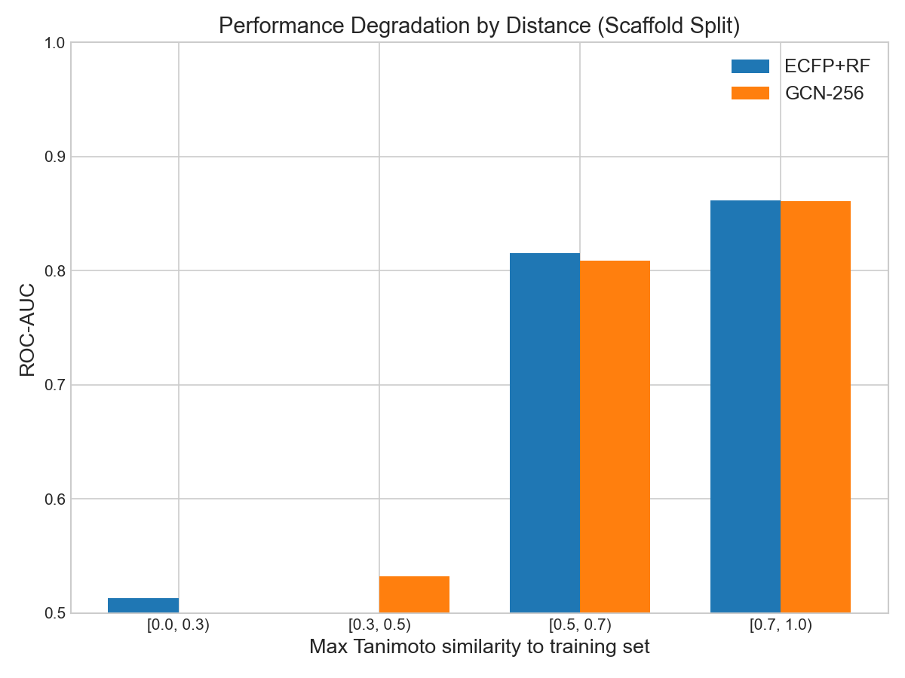

# GNN vs Fingerprint: EGFR Virtual Screening

> **"GNN이 분자의 그래프 구조를 직접 학습하면, fingerprint 기반 모델보다 새로운 화학 골격(scaffold)에 대해 더 잘 일반화할 수 있는가?"**

**결론: 아니오.** ECFP+Random Forest(ROC-AUC 0.820)가 scaffold split에서 모든 GNN 변형(0.750~0.807)을 이겼다. 이 문서는 그 이유를 분석한다.

---

## Dataset

| | |
|---|---|
| Target | EGFR (CHEMBL203) — 비소세포폐암 핵심 타깃 |
| Source | ChEMBL REST API, IC50 (exact, nM) |
| Molecules | 10,334 (정제 후) |
| Active (pIC50 >= 7.0) | 5,266 (51%) |
| Unique scaffolds | 3,755 |
| Split | Train 80% / Valid 10% / Test 10% |

---

## Results: Scaffold Split

Scaffold split은 test set에 training 때 한 번도 본 적 없는 화학 골격만 남긴다. 실전 virtual screening과 가장 가까운 평가.

### Baseline vs GNN

| Model | ROC-AUC | PR-AUC | EF1% | EF5% |
|-------|---------|--------|------|------|
| **ECFP+RF** | **0.820** | **0.773** | **2.57** | **2.47** |
| ECFP+XGB | 0.805 | 0.749 | 2.31 | 2.41 |
| ECFP+MLP | 0.783 | 0.696 | 2.31 | 2.16 |
| GCN (h=128) | 0.788 | 0.729 | 2.31 | 2.41 |
| GIN (h=128) | 0.778 | 0.722 | 2.31 | 2.47 |
| D-MPNN (h=128) | 0.787 | 0.709 | 1.80 | 2.36 |

### Ablation Study

| Model | ROC-AUC | Delta | What it tests |
|-------|---------|-------|---------------|
| GCN-256 | 0.807 | +0.019 | Capacity (128->256) |
| GCN-256-vn | 0.792 | +0.004 | Virtual node |
| AttentiveFP | 0.782 | -0.006 | Attention architecture |
| GCN-256-reg | 0.780 | -0.008 | Regression task |
| AttFP-reg-vn | 0.750 | -0.038 | All combined |

### Random Split (참고)

| Model | ROC-AUC |
|-------|---------|
| AttentiveFP | 0.919 |
| ECFP+XGB | 0.918 |
| D-MPNN | 0.912 |
| GCN-256-reg | 0.911 |
| ECFP+RF | 0.914 |

Random split에서는 모든 모델이 ~0.91로 비슷하다. 차이는 scaffold split에서만 나타난다.

---

## Analysis

### Enrichment Curves


상위 x%를 뽑았을 때 active 비율. 곡선이 높을수록 virtual screening에 실용적.

### Distance vs Performance



Test 분자가 training set과 멀어질수록(Tanimoto 낮아질수록) 성능이 떨어지는 패턴. ECFP+RF와 GCN-256 모두 비슷한 감쇠를 보인다.

### Uncertainty (MC Dropout)


GCN-256이 확신하는 분자(표준편차가 낮은)만 평가하면 AUC가 올라가는지. 모델이 자기 한계를 아는지 확인.

---

## Why ECFP Wins

### 1. Fixed Hash vs Learned Representation

ECFP는 각 원자 환경을 **고정 해시 함수**로 2048-bit 벡터에 매핑한다. 이 과정이 GNN의 message passing과 구조적으로 동일하지만, 결정적 차이가 있다:

- **ECFP**: 학습 데이터에 의존하지 않는 표현. 새로운 substructure가 와도 새로운 비트가 켜질 뿐, 기존 표현이 무너지지 않음
- **GNN**: Weight가 training 분포에 최적화됨. 새로운 scaffold는 학습한 패턴과 다른 입력을 만들어 부적절한 변환 유발

이것이 random split(같은 분포)에서는 비슷하고, scaffold split(다른 분포)에서 GNN이 떨어지는 이유.

### 2. 2048 vs 256 Dimensions

ECFP: 2048개의 **독립적 substructure detector**. XGBoost/RF가 관련 비트만 선택.
GCN-256: 분자의 모든 정보를 **256차원에 압축**. 정보 손실 불가피.

Hidden dim을 128->256으로 올렸을 때 즉시 +0.019 개선(0.788->0.807)이 이를 증명한다.

### 3. Expressiveness-Generalization Tradeoff

AttentiveFP가 random split에서 **전체 최고**(0.919)지만 scaffold split에서는 0.782로 하락. Attention이 training scaffold의 패턴에 과적합되어, 새로운 scaffold에서 엉뚱한 곳에 주의를 기울인다.

표현력이 높을수록 같은 분포에서는 강하지만, 분포가 바뀌면 더 취약해진다.

### 4. Regression Hurts

직관: 연속값(pIC50)을 학습하면 더 풍부한 정보를 쓸 수 있다.
현실: MSE loss가 전체 pIC50 범위를 맞추려 하면서, threshold(7.0) 근처의 decision boundary가 약해진다. Classification은 바로 그 경계에 집중하기 때문에 더 효율적.

### 5. Combining Everything Makes It Worse

각 "개선"이 약간의 불확실성을 추가하고, 이것이 곱셈적으로 누적된다. 복잡한 모델일수록 더 많은 데이터와 regularization이 필요한데, 10k molecules로는 부족하다.

---

## Key Takeaway

> ECFP는 **데이터에 무관한 고정 표현**이기 때문에 distribution shift에 강하고, GNN은 **데이터에 최적화된 학습 표현**이기 때문에 같은 분포에서는 강하지만 새로운 분포에서 약해진다.

이것은 "GNN이 나쁘다"가 아니라, **"언제 GNN을 쓰고 언제 fingerprint를 써야 하는가"** 에 대한 정직한 답이다.

GNN이 ECFP를 이기려면:
- 훨씬 큰 데이터셋 (100k+)
- Pre-training (self-supervised on large molecular corpus)
- 또는 ECFP와 GNN의 앙상블

---

## Reproduce

```bash
# Environment
conda create -n drug_discovery python=3.10
conda activate drug_discovery
pip install torch torchvision torchaudio
pip install torch-geometric rdkit chembl_webresource_client
pip install xgboost scikit-learn pandas numpy matplotlib seaborn
brew install libomp  # macOS only, for XGBoost

# Run pipeline
python src/data_pipeline.py    # Fetch & clean EGFR data from ChEMBL
python src/split.py            # Generate random + scaffold splits
python src/features.py         # Generate ECFP + molecular graphs

# Train & evaluate
OMP_NUM_THREADS=1 python src/baseline.py   # ECFP + XGB/RF/MLP
OMP_NUM_THREADS=1 python src/gnn.py        # GCN/GIN/D-MPNN (GPU recommended)
OMP_NUM_THREADS=1 python src/gnn_v2.py     # Ablation study (GPU recommended)

# Analysis
OMP_NUM_THREADS=1 python src/analysis.py   # Screening + Error + Uncertainty
```

---

## Project Structure

```
gnndrug/
├── src/
│   ├── data_pipeline.py     # ChEMBL API -> cleaned CSV
│   ├── split.py             # Random + scaffold splits
│   ├── features.py          # ECFP fingerprints + PyG graphs
│   ├── baseline.py          # ECFP + XGBoost / RF / MLP
│   ├── gnn.py               # GCN / GIN / D-MPNN
│   ├── gnn_v2.py            # Ablation: h=256, regression, virtual node, AttentiveFP
│   └── analysis.py          # Screening + Error + Uncertainty analysis
├── data/
│   ├── processed/           # egfr_cleaned.csv (10,334 molecules)
│   ├── splits/              # {random,scaffold}_{train,valid,test}.npy
│   └── features/            # ecfp_2048.npy, graphs.pt
├── results/                 # Performance CSVs + error_analysis.md
├── figures/                 # Enrichment, distance, confidence plots
└── docs/guide.md            # Detailed implementation guide (Korean)
```
