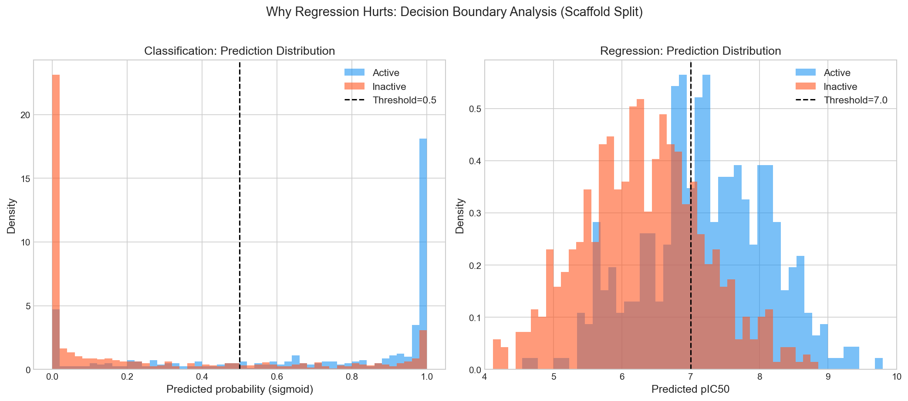
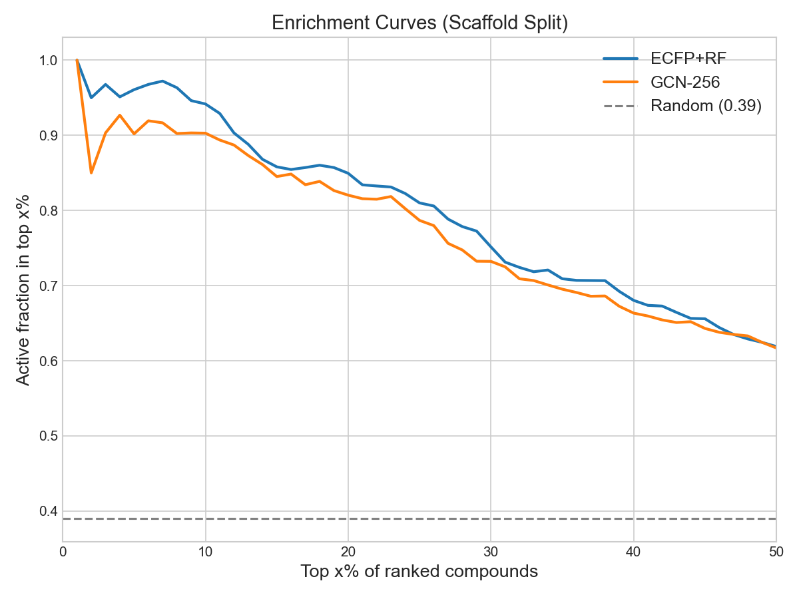
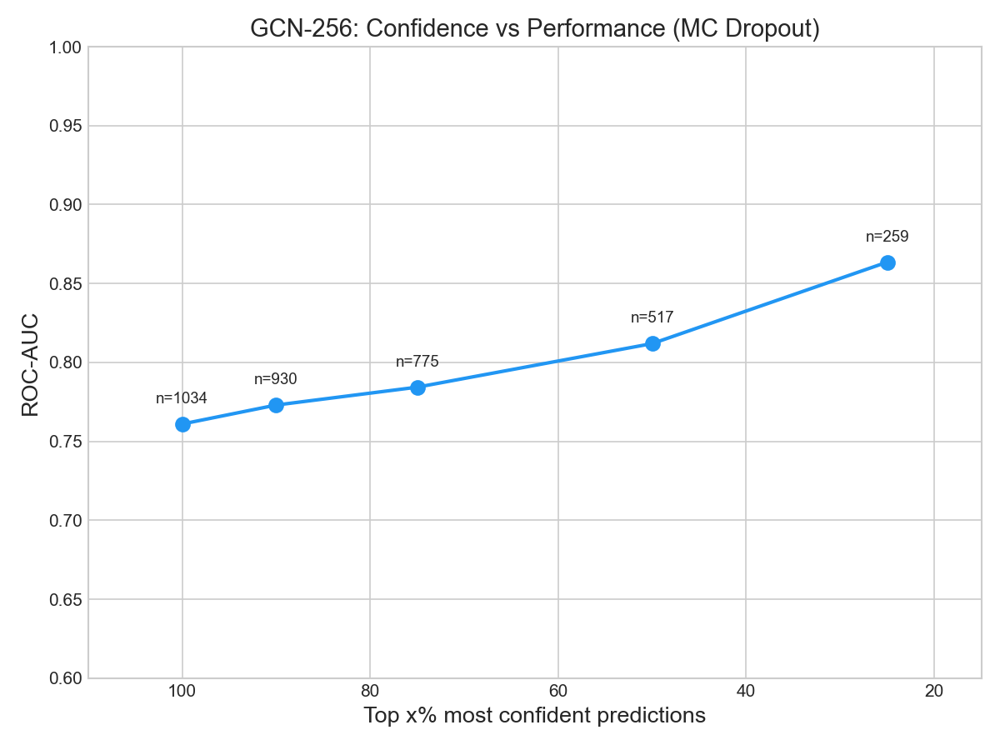

# GNN vs Fingerprint: Do Graph Neural Networks Generalize Better to Novel Chemical Scaffolds?

> **Can GNNs, by learning directly from molecular graph structure, outperform fixed fingerprint representations when predicting activity for chemically novel compounds?**

**Answer: No.** ECFP+Random Forest (ROC-AUC 0.819 +/- 0.001) consistently outperforms all GNN variants (0.780-0.799) on scaffold split. This repository documents the evidence and explains why.

---

## Dataset

| | |
|---|---|
| Target | EGFR (CHEMBL203) — key oncology target (NSCLC) |
| Source | ChEMBL REST API, IC50 (exact, nM) |
| Molecules | 10,334 (after cleaning) |
| Active (pIC50 >= 7.0, IC50 <= 100 nM) | 5,266 (51%) |
| Unique Murcko scaffolds | 3,755 |
| Split | Train 80% / Valid 10% / Test 10% |


**Known EGFR drugs in training set:** Erlotinib (pIC50=7.52), gefitinib (7.65), osimertinib (7.92), lapatinib (7.85) — all correctly labeled active and assigned to the training set by scaffold split. Afatinib was excluded during data cleaning (no exact IC50 value). These drugs serve as sanity checks: all models correctly predict high activity for these well-characterized inhibitors when evaluated on training data.

**Scaffold split details:** Train/test scaffold overlap = 0. However, 47.2% of test molecules have Tanimoto >= 0.7 to at least one training molecule (mean max Tanimoto = 0.635). This means the scaffold split is not as harsh as it could be — different scaffolds do not always mean different structures.

---

## Main Results (Scaffold Split, 3 seeds)

All results are mean +/- standard deviation across 3 random seeds (42, 123, 456).

| Model | ROC-AUC | PR-AUC |
|-------|---------|--------|
| **ECFP+RF** | **0.819 +/- 0.001** | **0.770 +/- 0.001** |
| ECFP+XGB | 0.814 +/- 0.002 | 0.766 +/- 0.007 |
| GCN-256 | 0.799 +/- 0.010 | 0.718 +/- 0.019 |
| AttentiveFP | 0.780 +/- 0.003 | 0.694 +/- 0.008 |

Key observations:
- **ECFP+RF is remarkably stable** (std = 0.001). The fixed hash representation leaves no room for seed-dependent variation.
- **GCN-256 has the highest variance** (std = 0.010). Learned representations are sensitive to initialization, making single-seed comparisons unreliable.
- **The gap is real**: even the best GCN-256 run (0.813) falls short of the worst ECFP+RF run (0.818).

### Ablation Study (single seed=42)

| Model | ROC-AUC | Delta vs GCN-128 | What it tests |
|-------|---------|-------------------|---------------|
| GCN-256 | 0.807 | +0.019 | Hidden dim 128 -> 256 |
| GCN-256-vn | 0.792 | +0.004 | + Virtual node |
| AttentiveFP | 0.782 | -0.006 | Attention architecture |
| GCN-256-reg | 0.780 | -0.008 | Regression (MSELoss on pIC50) |
| AttFP-reg-vn | 0.750 | -0.038 | All combined |

**Increasing hidden dim was the only consistently helpful change.** Everything else either didn't help or actively hurt performance.

---

## Why Regression Hurts



The intuition that "learning continuous pIC50 values provides richer supervision" is wrong for this task. The data shows why:

- **Classification**: Only 15.7% of test predictions fall in the ambiguous zone (sigmoid output 0.3-0.7). The model learns a sharp decision boundary.
- **Regression**: 61.9% of predictions fall near the threshold (pIC50 6.0-8.0). The model spreads its capacity across the entire pIC50 range instead of focusing on the active/inactive boundary.

Classification concentrates learning on the decision that matters. Regression dilutes it.

---

## Performance Degrades with Distance

| Max Tanimoto to training set | n | Active% | ECFP+RF | GCN-256 | Delta |
|------------------------------|---|---------|---------|---------|-------|
| [0.0, 0.3) — truly novel | 84 | 17.9% | 0.513 | 0.559 | +0.045 |
| [0.3, 0.5) — distant | 173 | 22.5% | 0.477 | 0.539 | +0.063 |
| [0.5, 0.7) — moderate | 289 | 33.6% | 0.816 | 0.835 | +0.020 |
| [0.7, 1.0) — similar | 488 | 51.6% | 0.861 | 0.845 | -0.016 |

This is the most important table in the project:

1. **Both models collapse below Tanimoto 0.5.** At Tanimoto < 0.3 (84 molecules), both ECFP+RF (0.513) and GCN-256 (0.559) are near random. No amount of graph learning helps when the test molecule is structurally alien.

2. **GNN shows a small advantage in the "distant" zone (0.3-0.5).** Delta = +0.063. This is the one regime where graph-level learning might add value — but the sample size (n=173) is small, this difference has not been statistically tested, and both AUCs are still poor (< 0.54).

3. **ECFP+RF wins in the "similar" zone (0.7-1.0).** Where it matters most (488 molecules, 47% of test set), the fixed hash beats the learned representation.

The claim that "GNNs generalize better to novel scaffolds" finds no support here. Both approaches degrade at the same rate.

---

## Enrichment: What This Means in Practice



ECFP+RF achieves EF1% = 2.57 on scaffold split. In practical terms:

> **In a 10,000-compound screening library with ~39% hit rate, screening only the top 100 compounds (1%) selected by ECFP+RF yields ~100 actives — compared to ~39 by random selection.** That's 2.6x more efficient than random, saving significant experimental cost.

The enrichment curves show ECFP+RF and GCN-256 perform comparably in the top 5-10%, with ECFP+RF slightly ahead.

---

## Uncertainty (MC Dropout)



GCN-256 with MC Dropout (30 forward passes) shows that filtering to the model's most confident predictions improves AUC. This suggests the model has some awareness of its own limitations — practically useful for prioritizing which predictions to trust.

---

## Why ECFP Wins: Five Reasons

### 1. Fixed Hash = Distribution-Invariant Representation

ECFP hashes each atomic neighborhood into a 2048-bit vector using a fixed function. This process is structurally identical to GNN message passing, but with one critical difference: the hash doesn't depend on training data. A novel substructure simply activates a new bit without corrupting existing representations. GNN weights, optimized for training scaffolds, produce inappropriate transformations for unseen scaffolds.

### 2. 2048 vs 256 Dimensions

ECFP provides 2048 independent substructure detectors. Random Forest selects the relevant ones. GCN-256 compresses all molecular information into 256 dense dimensions — information loss is inevitable. The immediate +0.019 gain from increasing hidden dim 128->256 confirms this bottleneck.

### 3. Expressiveness-Generalization Tradeoff

AttentiveFP achieves the highest random-split ROC-AUC (0.919) but drops to 0.780 on scaffold split. The attention mechanism memorizes which atoms matter for training scaffolds, then attends to the wrong features on novel scaffolds. Higher expressiveness = better in-distribution performance but worse out-of-distribution.

### 4. Regression Dilutes the Decision Boundary

As shown above, regression pushes 61.9% of predictions into the ambiguous zone around the activity threshold, versus 15.7% for classification. The model wastes capacity predicting the difference between pIC50=4.0 and pIC50=5.5 — both inactive, both irrelevant to the decision.

### 5. Combining "Improvements" Compounds Uncertainty

Each modification (regression, virtual node, attention) adds a small amount of model uncertainty. These uncertainties compound multiplicatively. More complex models need more data and regularization; 10k molecules cannot support it.

---

## Scaffold Split Leakage Analysis

A scaffold split guarantees no scaffold overlap between train and test. But **scaffold != structure**. Our analysis shows:

| Metric | Value |
|--------|-------|
| Test molecules with Tanimoto >= 0.7 to any train molecule | 488 / 1,034 (47.2%) |
| Test molecules with Tanimoto >= 0.5 | 777 / 1,034 (75.1%) |
| Mean max Tanimoto (test to train) | 0.635 |
| Median max Tanimoto | 0.683 |

Nearly half of "novel scaffold" test molecules are structurally very similar to training molecules (Tanimoto >= 0.7). This means ECFP+RF's 0.819 AUC is partly driven by structural similarity despite scaffold novelty. The true out-of-distribution performance (Tanimoto < 0.3) is ~0.51 for both models — essentially random.

---

## Key Takeaway

> ECFP is a **data-independent fixed representation** that is robust to distribution shift. GNN is a **data-optimized learned representation** that excels in-distribution but degrades under shift. On scaffold-split EGFR with 10k molecules, the fixed representation wins.

This is not "GNNs are bad." It's an honest answer to **"when should you use GNNs vs fingerprints."** GNNs may outperform ECFP with:
- Much larger datasets (100k+)
- Pre-training on large molecular corpora
- Ensemble with ECFP (complementary representations)

---

## Reproduce

```bash
# Environment
conda create -n drug_discovery python=3.10
conda activate drug_discovery
pip install -r requirements.txt
brew install libomp  # macOS only, for XGBoost

# Pipeline
python src/data_pipeline.py          # Fetch EGFR IC50 data from ChEMBL
python src/split.py                  # Random + scaffold splits
python src/features.py               # ECFP fingerprints + molecular graphs

# Train & evaluate
OMP_NUM_THREADS=1 python src/baseline.py    # ECFP + XGBoost/RF/MLP
python src/gnn.py                           # GCN/GIN/D-MPNN (GPU recommended)
python src/gnn_v2.py                        # Ablation study (GPU recommended)

# Analysis
OMP_NUM_THREADS=1 python src/analysis.py    # Screening + Error + Uncertainty
python src/analysis_v2.py                   # Leakage + Regression analysis
python src/multiseed.py                     # 3-seed validation (GPU recommended)
```

## Project Structure

```
gnndrug/
├── src/
│   ├── utils.py              # Shared metrics, training loop, model definitions
│   ├── data_pipeline.py      # ChEMBL API -> cleaned CSV
│   ├── split.py              # Random + scaffold splits
│   ├── features.py           # ECFP fingerprints + PyG molecular graphs
│   ├── baseline.py           # ECFP + XGBoost / RF / MLP
│   ├── gnn.py                # GCN / GIN / D-MPNN
│   ├── gnn_v2.py             # Ablation: hidden dim, regression, virtual node, AttentiveFP
│   ├── analysis.py           # Screening + Error + Uncertainty analysis
│   ├── analysis_v2.py        # Leakage quantification + regression threshold analysis
│   └── multiseed.py          # Multi-seed validation (3 seeds x 4 models)
├── data/
│   ├── processed/            # egfr_cleaned.csv (10,334 molecules)
│   ├── splits/               # {random,scaffold}_{train,valid,test}.npy
│   └── features/             # ecfp_2048.npy, graphs.pt
├── results/                  # Performance CSVs + error_analysis.md
├── figures/                  # All analysis plots
├── requirements.txt          # Pinned package versions
└── docs/guide.md             # Detailed implementation guide (Korean)
```
